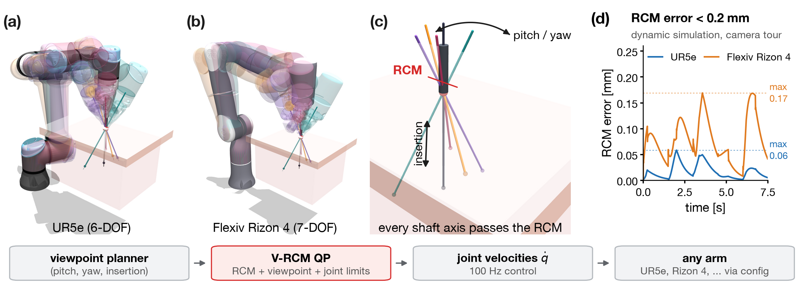

# Virtual RCM: QP-Based Remote Center of Motion Control for General-Purpose Arms

<p align="center">
  
</p>

<p align="center"><em>
<b>(a, b)</b> Two different arms, a 6-DOF UR5e and a 7-DOF Flexiv Rizon 4, move a surgical instrument through a viewpoint tour; translucent poses show successive stops.
<b>(c)</b> Close-up of the trocar: the axis of the instrument shaft passes through the remote center of motion (RCM) in every pose, while the tool pitches, yaws and inserts.
<b>(d)</b> RCM error during the scripted tour in dynamic simulation.
</em></p>

This repository provides a **Virtual Remote Center of Motion (V-RCM)** controller for
a surgical instrument or endoscope mounted on a general-purpose robot arm, together
with a MuJoCo simulation environment for evaluating it.

In minimally invasive surgery, the instrument shaft must keep passing through the
incision point (the trocar) while the tool is reoriented and inserted. Dedicated
surgical robots enforce this mechanically. This project enforces it in software
instead: at every control cycle, a small constrained quadratic program (QP) computes
joint velocities that keep the shaft axis on the RCM. The same QP tracks the commanded
viewpoint and insertion depth and respects joint position and velocity limits. A
higher-level planner therefore only needs to issue `(pitch, yaw, insertion)` viewpoint
actions.

## Highlights

- **Software-defined RCM.** Any serial arm can be used, with no mechanical RCM linkage.
- **Constrained QP control.** RCM feedback, viewpoint tracking, insertion control and
  joint limits are combined in a single problem, solved by a dependency-free dense QP
  solver.
- **Robot-agnostic.** Each arm is described entirely by a JSON configuration, and the
  package has no robot-specific code paths.
- **Planner interface.** A rate-limited viewpoint planner turns discrete
  `(pitch, yaw, insertion)` actions into smooth references, and a coarse-to-fine
  stop-and-go viewpoint search is included.
- **Kinematic and dynamic evaluation.** The controller can be run on ideal kinematics
  or through MuJoCo actuators with full rigid-body dynamics.

## Method

Let $p_r$ be the fixed RCM (trocar) point, $p_e$ a reference point on the instrument
and $d$ the unit direction of the shaft. The RCM condition requires $p_r$ to lie on
the instrument axis, not $p_e$ to remain fixed, so insertion along $d$ remains free.
The RCM error is the component of $p_e - p_r$ perpendicular to the shaft:

$$
e_{\mathrm{RCM}} = (I - d d^\top)(p_e - p_r).
$$

At every control cycle the controller solves for the joint velocity $\dot q$:

$$
\begin{aligned}
\min_{\dot q}\quad & \tfrac12 \lVert J_\omega \dot q - \omega_{\mathrm{des}} \rVert^2 + \tfrac{\lambda}{2} \lVert \dot q \rVert^2 \\
\text{s.t.}\quad & J_{\mathrm{RCM}}\, \dot q = -k_{\mathrm{RCM}}\, e_{\mathrm{RCM}}, \\
& d^\top J_v\, \dot q = v_{\mathrm{ins}}, \\
& \dot q_{\min} \le \dot q \le \dot q_{\max}, \\
& q_{\min} + \epsilon \le q + \dot q\, \Delta t \le q_{\max} - \epsilon .
\end{aligned}
$$

The objective tracks the desired viewing rotation. The equality constraints keep the
shaft on the RCM (with feedback correction of any accumulated error) and command the
insertion velocity. The inequality constraints enforce joint velocity and position
limits. The full derivation, including the viewpoint planning interface and the
stop-and-go loop, is given in [method.md](method.md).

## Supported Robots

Both arms carry the `tom_dissector` instrument.

| Configuration | Robot | DOF |
|---|---|---|
| [configs/ur5e.json](configs/ur5e.json) | Universal Robots UR5e (MuJoCo Menagerie) | 6 |
| [configs/flexiv_rizon4.json](configs/flexiv_rizon4.json) | Flexiv Rizon 4 | 7 |

## Results

RCM error over the scripted camera tour (7.5 s, 100 Hz control), as produced by
[scripts/run_headless.py](scripts/run_headless.py):

| Robot | Mode | Max RCM error [mm] | RMS RCM error [mm] |
|---|---|---:|---:|
| UR5e | kinematic | 0.051 | 0.017 |
| UR5e | dynamic | 0.058 | 0.022 |
| Flexiv Rizon 4 | kinematic | 0.040 | 0.017 |
| Flexiv Rizon 4 | dynamic | 0.169 | 0.088 |

Logs, plots and viewpoint-search tables are written to [results/](results/).

## Installation

Python 3.10 or later is required.

```bash
pip install -e .            # core: numpy, mujoco
pip install -e ".[dev]"     # adds pytest, scipy, matplotlib
pip install -e ".[viz]"     # adds viser, for the browser viewer
```

Alternatively, `pip install -r requirements.txt` installs all dependencies.

## Usage

### Browser Viewer

```bash
python scripts/demo_viser.py ur5e --mode dynamic
# then open http://localhost:8080
```

The control panel has three sections:

- **Viewpoint goal:** sliders for pitch and yaw [deg] and depth [mm], together with
  **Home**, **Hold** (stop at the current reference) and **Paused** controls. The
  planner rate-limits every change, so slider input produces smooth motion.
- **Status:** the current RCM error, insertion depth and pitch/yaw reference.
- **RCM error plot:** a scrolling plot of the RCM error [mm] over the last
  `--plot-window` seconds of simulated time.

The RCM frame is visualized at the trocar by a red sphere at the RCM point, a triad
in the shaft frame (z along the shaft; x and y the pitch and yaw axes), and a magenta
segment to the closest point on the shaft axis (the RCM error vector, shown only when
the error is non-zero).

The viewer requires no display and no `mjpython`, and can be used over SSH with port
forwarding. Options: `--control-rate` (default 100 Hz), `--render-rate` (30 Hz),
`--plot-rate` (10 Hz), `--plot-window` (10 s), `--port` (8080).

### MuJoCo Viewer

```bash
python scripts/demo_viewer.py ur5e --mode dynamic
```

The key bindings avoid all keys reserved by the MuJoCo viewer and are available on a
Mac keyboard:

| Key | Action |
|---|---|
| `Up` / `Down` | pitch ± 2° (`--step`) |
| `6` / `7` | yaw ± 2° |
| `8` / `9` | insert / retract 5 mm (`--insert-step`) |
| `Enter` | return to the home viewpoint |
| `.` | hold the current position |
| `F6` | toggle the RCM error readout in the console (`fn+F6` on a Mac) |
| `Space` | pause / resume |

The RCM frame is drawn as in the browser viewer.

> **Note (macOS).** The viewer must run under `mjpython`; the script re-launches
> itself accordingly. With a uv-managed Python, `mjpython` may fail with
> `Library not loaded: @rpath/libpython3.12.dylib`. The script works around this by
> adding the interpreter's `LIBDIR` to `DYLD_FALLBACK_LIBRARY_PATH`. When starting
> `mjpython` manually, either set this variable or link the library into the virtual
> environment:
>
> ```bash
> ln -s "$(python -c 'import sysconfig; print(sysconfig.get_config_var("LIBDIR"))')/libpython3.12.dylib" .venv/
> ```

### Headless Evaluation

```bash
python scripts/run_headless.py --robots ur5e flexiv_rizon4 --modes kinematic dynamic
```

For every robot and execution mode, the script runs two experiments and writes CSV
logs, plots and scan tables to [results/](results/):

1. a scripted camera tour ([method.md](method.md), §10);
2. a coarse-to-fine stop-and-go viewpoint search driven by a geometric visibility
   model (§11).

It then prints a summary of the RCM error (maximum and RMS), the viewpoint direction
error, the depth range and the best scan score.

### Home Configuration

```bash
python scripts/generate_home.py               # dry run for all configurations
python scripts/generate_home.py ur5e --write  # write home_qpos into configs/ur5e.json
```

The script solves inverse kinematics for the configuration in which the instrument is
parked at the trocar: the shaft points along `--shaft-direction` (world −z by default)
and the tip is at the home insertion depth.

### Teaser Figure

```bash
python scripts/make_teaser.py
```

The script regenerates [figures/teaser.png](figures/teaser.png) and
[figures/teaser.pdf](figures/teaser.pdf) from the simulation and the logs in
[results/](results/).

## Execution Modes

| Mode | Behavior |
|---|---|
| `kinematic` | The QP joint velocity is integrated directly, so the RCM error reflects only the controller. Used for analysis and tests. |
| `dynamic` | Joint velocities become position set-points for the MuJoCo actuators and the model is stepped with `mj_step`, so actuator tracking error appears as RCM drift that the feedback term must correct. Set-points include gravity, velocity and acceleration feed-forward (`SimConfig.acceleration_feedforward`). Compliant servos can be stiffened per robot with `actuator_kv_scale` in the configuration (10 for the Flexiv). |

## Library

```python
from vrcm import VrcmConfig, VrcmSim, SimConfig, ViewpointPlanner, VrcmTarget, load_robot_spec
```

| Module | Contents |
|---|---|
| [vrcm/rcm.py](src/vrcm/rcm.py) | RCM kinematics: error, Jacobian, shaft frame |
| [vrcm/qp.py](src/vrcm/qp.py) | dependency-free dense constrained QP solver |
| [vrcm/controller.py](src/vrcm/controller.py) | QP-based V-RCM velocity controller |
| [vrcm/planner.py](src/vrcm/planner.py) | viewpoint planner: `(pitch, yaw, insertion)` → rate-limited reference |
| [vrcm/visibility.py](src/vrcm/visibility.py) | visibility model and stop-and-go viewpoint search |
| [vrcm/robot.py](src/vrcm/robot.py) | robot-agnostic wrapper around the MuJoCo model |
| [vrcm/scene.py](src/vrcm/scene.py) | assembly of robot, instrument and phantom into one scene |
| [vrcm/sim.py](src/vrcm/sim.py) | simulation environment and control loop |
| [vrcm/ik.py](src/vrcm/ik.py) | damped least-squares IK and home-pose solver |
| [vrcm/specs.py](src/vrcm/specs.py) | robot, instrument and scene specifications loaded from `configs/` |

### Adding a Robot

1. Place the robot's MJCF model under `assets/robots/`.
2. Write a configuration file in `configs/` following the existing examples.
3. Run `python scripts/generate_home.py <name> --write` to compute the home
   configuration.

No code changes are required.

## Tests

```bash
pytest
```

## License

This project is released under the Apache License 2.0; see [LICENSE](LICENSE). The
robot and instrument assets under [assets/](assets/) retain their own licenses.
